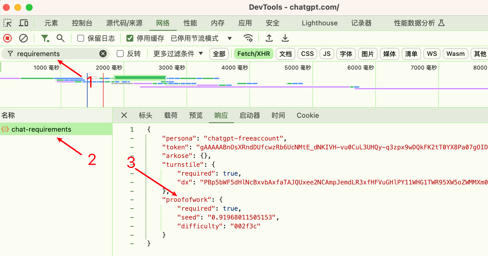
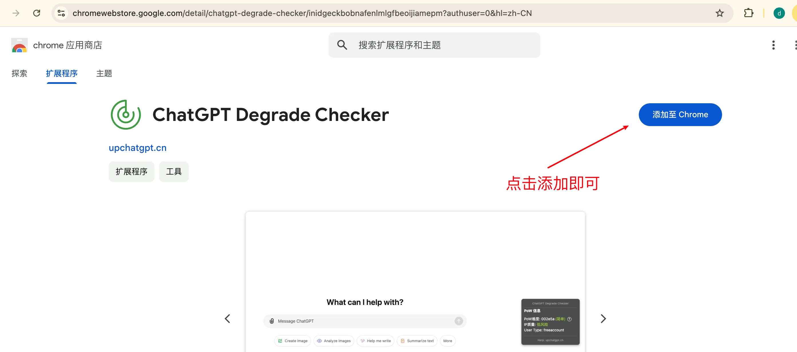
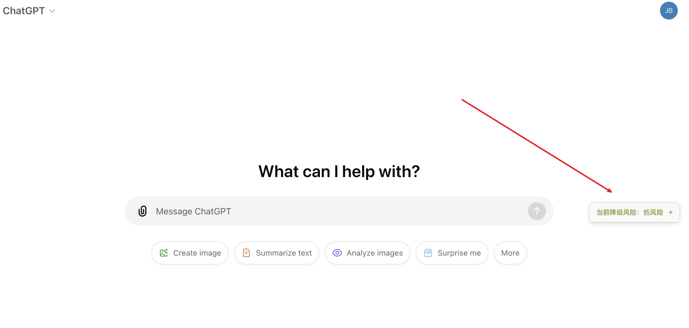
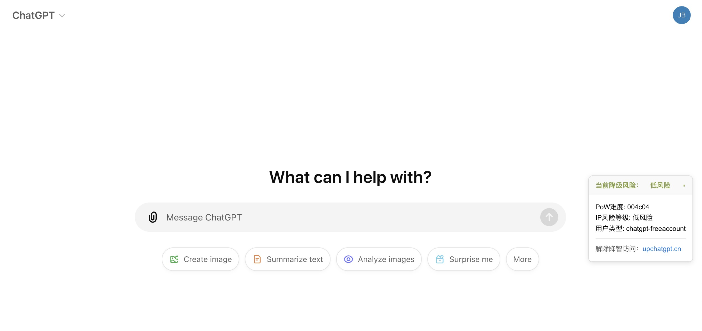
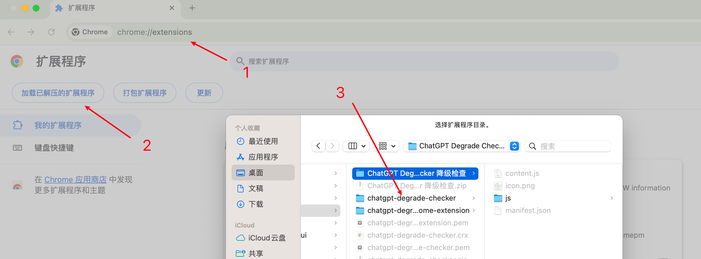

旧版本的仓库已经删除，重新写了，不使用开源UI了，避免太多的纠纷。可能在其他平台推广的方式不对，导致了误解。但是每个推广内容都有提他，和文末都推广他的github仓库了，但忘记附加我自己的仓库地址导致误解了吧。历史仓库有人fork，可以看看历史发布时间。[https://github.com/sdtm1016/chatgpt-degrade-checker](https://github.com/sdtm1016/chatgpt-degrade-checker)

## ChatGPT服务降级检测工具（Chrome扩展程序）
由于 ChatGPT 会对某些 IP 进行无提示的服务降级，此Chrome扩展程序用于检测你的 IP 是否被 ChatGPT 判定为高风险。在一定程度上可以用于辅助判断你的 IP 是否遭到服务降级。

## 检测原理
根据PoW（Proof of Work）的机制，会生成一个16进制的数值。数值越大，IP环境就越安全。正常大于4位以上的16进制，基本就不会降智了。

## 开箱即用

1. 安装Chrome扩展程序：[ChatGPT Degrade Checker扩展程序](https://chromewebstore.google.com/detail/chatgpt-degrade-checker/inidgeckbobnafenlmlgfbeoijiamepm?authuser=0&hl=zh-CN)

2. 添加至Chrome之后，直接打开ChatGPT刷新页面，提示框会显示你的 风险信息。

3. 点击提示框，可以查看 PoW信息和IP风险等级。

## 本地开发：安装及使用

1. 打开Chrome浏览器，输入：[chrome://extensions/](chrome://extensions/)
2. 导入扩展程序，选择 `chatgpt-degrade-checker` 文件夹即可

## GPT4降智了怎么解决？
下面每个解决方式均独立，使用其中一种即可。
1. 套cf，如 Cloudflare Warp。
2. 切换到ChatGPT APP版本
3. 网页版按F12，进入控制台之后，改为移动端展示，然后刷新页面，就会解除（`这个方式，是最快让你解除降智的，但临时方案，不推荐一直这么做`）
4. 切换到比较干净的IP，不要使用共享、便宜的魔法
5. 上传一张白图，强制启动
6. 移动端触发o1思考，web端同步刷新，也能恢复
