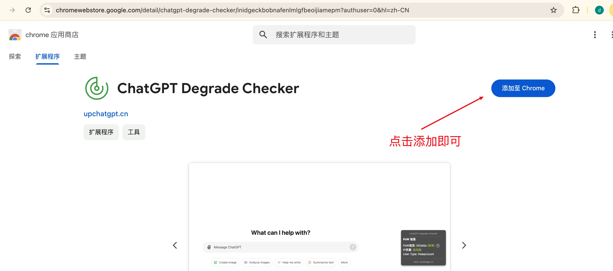
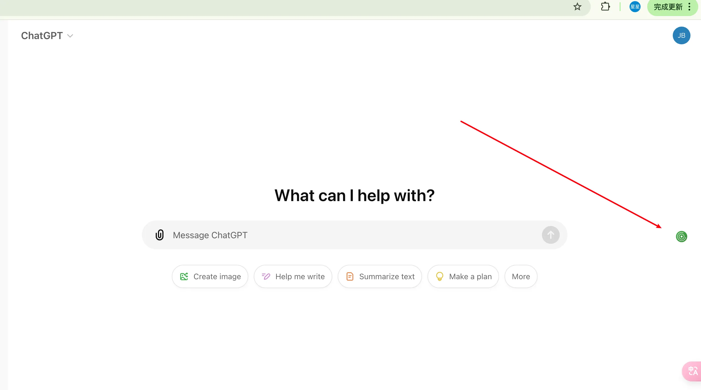
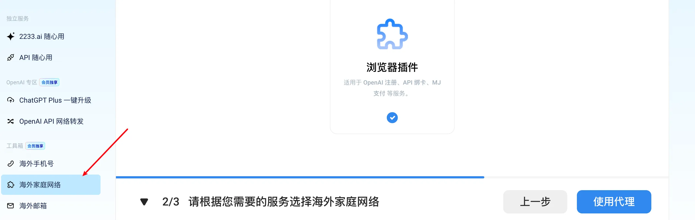

[@KoriIku](https://github.com/KoriIku) 已经开发了这个工具，但由于需要先安装 tampermonkey 再安装脚本的方式比较繁琐，所以我开发了这个Chrome扩展程序，方便小白使用。

## ChatGPT服务降级检测工具（Chrome扩展程序）
由于 ChatGPT 会对某些 IP 进行无提示的服务降级，此Chrome扩展程序用于检测你的 IP 是否被 ChatGPT 判定为高风险。在一定程度上可以用于辅助判断你的 IP 是否遭到服务降级。

## 开箱即用

1. 安装Chrome扩展程序：[ChatGPT Degrade Checker扩展程序](https://chromewebstore.google.com/detail/chatgpt-degrade-checker/inidgeckbobnafenlmlgfbeoijiamepm?authuser=0&hl=zh-CN)

2. 添加至Chrome之后，直接打开ChatGPT刷新页面，鼠标移动到`小绿圈`处，会显示你的 PoW 信息。

## 本地开发：安装及使用

1. 打开Chrome浏览器，输入：[chrome://extensions/](chrome://extensions/)
2. 导入扩展程序，选择 `chatgpt-degrade-checker` 文件夹即可

作为参考，这个值在超过 5 位时，一般代表你的ip较为优质，可以正常使用所有服务，如果小于等于 000032，说明你的 ip 被认为有很高的风险。

（更详细的区分尚不清晰，[@KoriIku](https://github.com/KoriIku) 简单测试了几个 ip，发现即便对同一个 ip，其要求的 PoW 也很容易变动，例如，如果已经完成了一个较困难的 PoW，下一次的 PoW 难度就会稍稍降低，但不会降低到“简单”级别。）

## 什么是服务降级？
ChatGPT 会对一些被判断为高风险的 IP 降级服务，偷偷将模型切换为 GPT-4o-mini 或者更差，并且没有任何提示。

## 服务降级有什么影响？
降级后，即便你是 Plus 用户，在使用 4o 模型时会发现无法使用联网搜索、图片生成等功能，使用 o1 模型时，会发现模型不进行思考直接回答。

## GPT4降智了怎么解决？

1. 通用的解决方案就是套wrap，如 Cloudflare Warp。
2. 切换到ChatGPT APP版本
3. 网页版按F12，进入控制台之后，改为移动端展示，然后刷新页面，就会解除（`这个方式，是最快让你解除降智的，但临时方案，不推荐一直这么做`）
4. 切换到比较干净的IP，不要使用共享、便宜的魔法

## 如何升级ChatGPT-4 Plus

当你的IP相对干净时，就可以升级你的ChatGPT，不干净的IP不建议使用当前的IP进行升级。

如果你的IP风险过高时，可以用其他浏览器插件解决，解决方案：可以使用**wildcard虚拟卡平台的浏览器插件** ：[浏览器插件](https://bewildcard.com/i/UPGPT)。

> wildcard官网：[https://bewildcard.com/i/UPGPT](https://bewildcard.com/i/UPGPT)

小白的话，直接使用一键升级就行了。

**新手升级GPT4教程：**[https://upchatgpt.cn/how-upgrade-chatgpt-plus/](https://upchatgpt.cn/how-upgrade-chatgpt-plus/)

## 特别致谢
- https://github.com/KoriIku/chatgpt-degrade-checker