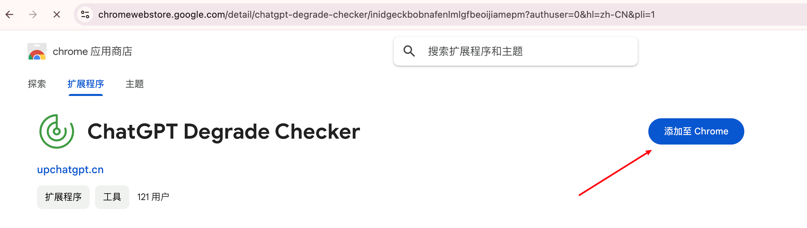

旧版本的仓库已经删除，重新写了，不使用开源UI了，避免太多的纠纷。

## First, What is PoW (Proof of Work)?

**Proof of Work (PoW) is a consensus algorithm widely used in blockchain and other distributed systems to prevent resource abuse (e.g., spam) and ensure system security.** With PoW, participants are required to complete computational tasks to prove they have done "work."

### Real-World Applications:
1. **Blockchain:**  
   Used in mining, where completing PoW tasks generates new blocks and earns rewards. This ensures miners expend computational resources to create blocks.
2. **Abuse Prevention:**  
   Used to prevent spam or service abuse, such as requiring users to complete a PoW task before submitting a request.

### Optimization and Limitations:

1. **Optimization:**  
   - Using more efficient hash algorithms or hardware accelerations (e.g., GPUs) to speed up computation.  
   - Dynamically adjusting the `difficulty` to match system loads.

2. **Limitations:**  
   - High energy consumption, especially in large-scale applications.  
   - High computation costs compared to low verification costs, potentially leading to resource wastage.

`The generation of PoW mainly involves computing based on a seed value (seed) and a difficulty target (difficulty).`

Therefore, ChatGPT often lowers the PoW difficulty for higher-risk IPs as a risk control measure. When under risk control, ChatGPT may degrade services without explicit notifications. **You can use ChatGPT downgrade detection tools to check if your IP is flagged as high-risk by ChatGPT**, which can help determine if your IP has been downgraded due to risk control measures.

---

## Detection Principle
Based on the PoW (Proof of Work) mechanism, a hexadecimal `difficulty` value is generated. The higher the `difficulty`, the safer the IP environment. Generally, a difficulty value with more than four hexadecimal digits indicates a safe environment, which is unlikely to trigger service degradation.

## Ready to Use

1. Install the Chrome extension directly: [ChatGPT Degrade Checker Extension](https://chromewebstore.google.com/detail/chatgpt-degrade-checker/inidgeckbobnafenlmlgfbeoijiamepm?authuser=0&hl=zh-CN)

2. After adding it to Chrome, open ChatGPT, and you will see a notification box in the middle-right corner indicating the risk level of your IP. Clicking on the box will expand to show detailed PoW detection information.  

3. Additionally, the tool allows simple downgrade mitigation by increasing the PoW difficulty. Just click "Enable Smart Mitigation." Clicking it again will revert to the original user agent (UA).  

Every time ChatGPT initiates a PoW calculation request, the tool checks your IP risk level in real-time, updating the risk level and color. If you see orange or red indicators, it’s highly likely that your IP has been flagged and downgraded by ChatGPT’s risk control system.

---

## Local Development: Installation and Usage

1. Open Chrome and navigate to: [chrome://extensions/](chrome://extensions/)  
2. Import the extension by selecting the `chatgpt-degrade-checker` folder.

---

## How to Resolve GPT-4 Downgrade?  
The following solutions are independent; you only need to use one of them:

1. Use a Cloudflare proxy, such as Cloudflare Warp.  
2. Switch to the ChatGPT app version.  
3. On the web version, press `F12`, go to the console, switch to mobile view, and refresh the page. *(This is the quickest way to lift a downgrade but is only a temporary fix and not recommended for long-term use.)*  
4. Switch to a clean IP address. Avoid shared or inexpensive proxies.  
5. Upload a blank image to force reinitialization.  
6. Trigger an "o1 thinking" process on mobile, and refresh the web version simultaneously to restore access.  

## 首先了解一下什么是 PoW（Proof of Work）？

**工作量证明 (Proof of Work, PoW) 是一种广泛应用于区块链和其他分布式系统的共识算法，用于防止滥用资源（如垃圾邮件）和确保系统的安全性。** 通过 PoW，系统要求参与者完成某种计算任务来证明他们做了“工作”。

### 实际应用场景：
1. 区块链：用于挖矿，通过完成 PoW 任务生成新区块并获得奖励。确保矿工为区块生成付出了计算资源。
2. 防止滥用：
用于防止垃圾邮件或滥用服务，例如在用户提交请求前要求完成一个 PoW 任务。

### 优化与限制：

1. 优化：使用更高效的哈希算法或硬件加速（如 GPU）来加快计算。动态调整 difficulty 以适应系统负载。
2. 限制：能源消耗高，尤其在大规模应用中。验证成本低但计算成本高，可能导致资源浪费。

`PoW的生成主要是通过对一个种子值 (seed) 和难度目标 (difficulty) 的计算来完成。`

所以ChatGPT通常会对较高风险的IP，调小PoW的difficulty的值来进行风控。被风控时，ChatGPT可能会进行无提示的服务降级，**可以通过ChatGPT降级检查工具扩展来检测你的IP是否被ChatGPT判定为高风险的情况**。某种程度上可以用于辅助判断你的IP是否遭到ChatGPT的风控降级。

## 检测原理
根据PoW（Proof of Work）的机制，会生成一个16进制的difficulty。difficulty数值越大，IP环境就越安全。正常大于4位以上的16进制，基本就不会降智了。

## 开箱即用

1. 直接安装Chrome扩展程序：[ChatGPT Degrade Checker扩展程序](https://chromewebstore.google.com/detail/chatgpt-degrade-checker/inidgeckbobnafenlmlgfbeoijiamepm?authuser=0&hl=zh-CN)

2. 添加至Chrome之后，打开ChatGPT就可以看到右侧中间有个提示框，会提示当前你的ip风险情况。 当你点击提示框之后，就会展开检测的pow信息。

3. 同时，可以通过该检测工具进行简单的解除降级，进行提高pow的难度。点击开启智能解除降智就行，重新点击已开启的话，就会恢复原来的ua。

只要每次chatgpt发起了pow计算的请求时，就会实时的检查你的IP风险情况，改变风险等级和颜色。当你见到橙色和红色时，大概率就是已经被ChatGPT风控降级了。

## 本地开发：安装及使用

1. 打开Chrome浏览器，输入：[chrome://extensions/](chrome://extensions/)
2. 导入扩展程序，选择 `chatgpt-degrade-checker` 文件夹即可

## GPT4降智了怎么解决？
下面每个解决方式均独立，使用其中一种即可。
1. 套cf，如 Cloudflare Warp。
2. 切换到ChatGPT APP版本
3. 网页版按F12，进入控制台之后，改为移动端展示，然后刷新页面，就会解除（`这个方式，是最快让你解除降智的，但临时方案，不推荐一直这么做`）
4. 切换到比较干净的IP，不要使用共享、便宜的魔法
5. 上传一张白图，强制启动
6. 移动端触发o1思考，web端同步刷新，也能恢复
